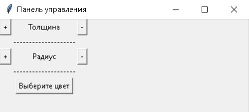
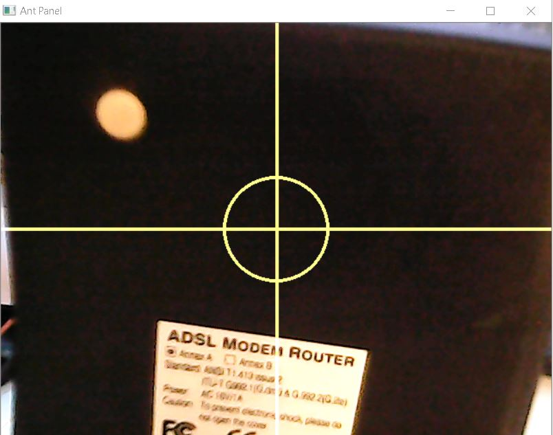

# TaFc
TAFC - TargetFuelCapture

## Инструкция по эксплуатации.

1. Скачайте релиз приложения.
2. Распакуйте в любое место на компьютере.
3. Запустите файл panel.exe.
4. Скройте командную строку.

5. Запустите файл firstversion.exe.
6. Откроется терминал. В нем спросят какую камеру вы хотите использовать.
```language
По умолчанию, у вас в компьютере есть веб камера которая у которой id:0.
Остальные камеры идут по порядку. То есть: 1,2,3,4,5...
Вам остается только ввести номер камеры, которую хотите использовать.
То есть если у вас камера usb и у вас ноутбук, надо написать 1. 
Если у вас не ноутбук, а компьютер без встроенной камеры, то надо будет написать 0.
```
7. Скройте терминал и вас появится окно с видео, где будет уже готовый прицел. 


Вам остается расположить все как вам удобно и изменять параметры прицела в окне panel.exe.

Удачи в использовании.

P.S.

Это первая версия программы. Довольно грубая. Но скоро мы ее сделаем лучше и быстрее.
